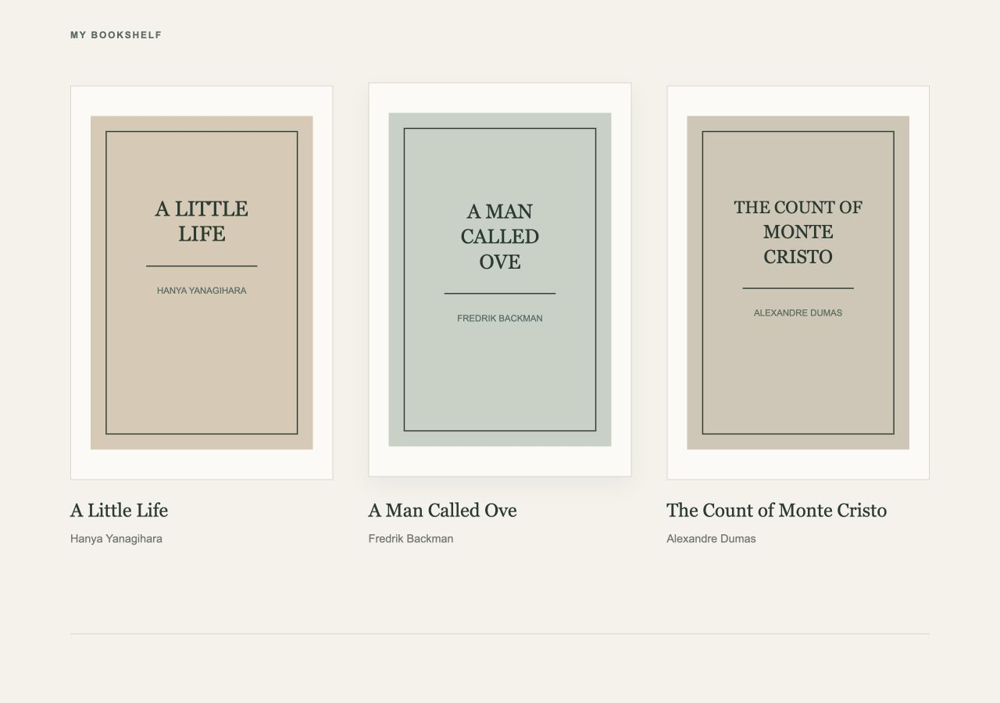
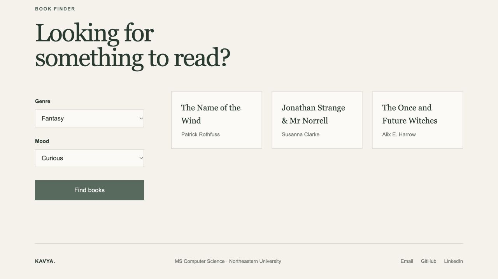

# Kavya Kusuma Reddy Korem: Personal Homepage

**Live site:** <https://kavya-korem.github.io/cs5610-project1/>  
**Repository:** <https://github.com/kavya-korem/cs5610-Project-1->

## Author

Kavya Kusuma Reddy Korem, MS Computer Science, Northeastern University  
**Email:** <korem.k@northeastern.edu>

## Class

CS5610.18490 Web Development, Northeastern University, Fall 2026 Semester Full Term.

**Class link:** [CS5610 Web Development course page](https://johnguerra.co/classes/webDevelopment_online_fall_2026/)

## Project objective

A personal homepage that introduces my academic background, technical skills, and selected projects, with a Bookshelf page that shares my interest in reading. The interactive book finder returns three recommendations for a selected genre and mood. The site uses vanilla HTML5, CSS3, and JavaScript modules, with no framework, build step, or backend.

## Pages

| Page      | File           | Content                                                                      |
| --------- | -------------- | ---------------------------------------------------------------------------- |
| Home      | `index.html`   | Introduction, current program, technical skills, and three selected projects |
| About     | `about.html`   | Academic background, technical areas, and current coursework                 |
| Bookshelf | `ai-page.html` | Three favorite books and an interactive genre and mood book finder           |

## Screenshots

These screenshots show the pages running from this project. Desktop and mobile viewport captures are included in [`docs/screenshots/`](docs/screenshots/).

### Home


[Home desktop screenshot](docs/screenshots/home-desktop.png)

### About


[About desktop screenshot](docs/screenshots/about-desktop.png)

### Bookshelf



[Bookshelf desktop screenshot](docs/screenshots/bookshelf-desktop.png)

### Book finder



The illustrated selection returns _The Name of the Wind_ by Patrick Rothfuss, _Jonathan Strange & Mr Norrell_ by Susanna Clarke, and _The Once and Future Witches_ by Alix E. Harrow.

## Creative component

The book finder on `ai-page.html` uses three genres (Fiction, Mystery, and Fantasy) and four moods (Thoughtful, Adventurous, Cozy, and Curious). A local dataset in `js/main.js` covers all 12 combinations, with three title and author pairs for each combination.

Clicking **Find books** reads both selections, clears the previous results, and creates three recommendation articles with `document.createElement` and `textContent`. Results appear without a page reload or an external API request. The controls have associated labels, and the results container uses `aria-live="polite"`.

## Technology

- HTML5 with semantic page sections and descriptive book-cover alt text.
- CSS3 with Grid, Flexbox, custom properties, and responsive breakpoints at 800px and 500px.
- Native JavaScript ES modules for the book finder.
- ESLint and Prettier for development checks.
- GitHub Pages for the published static site.

## Run locally

The project needs an HTTP server so the browser can load its JavaScript module. Node.js 22.13 or newer is suitable for the included development tools.

From the project folder:

```bash
npm ci
npm start
```

Open <http://localhost:8080>. The included server uses Node.js built-in modules and does not require a build step. `PORT=8081 npm start` runs it on a different port if needed.

Alternatively, Python 3 can serve the same folder without installing the development tools:

```bash
python3 -m http.server 8080
```

## Formatting and linting

```bash
npm run format        # apply Prettier
npm run format:check  # check formatting
npm run lint          # check JavaScript
npm run check         # formatting and linting together
```

## Folder structure

```text
cs5610-project1/
├── index.html
├── about.html
├── ai-page.html
├── css/
│   └── style.css
├── js/
│   └── main.js
├── images/                  # SVG book covers and favicon
├── design/
│   ├── design.md
│   └── mockups/             # supplied page wireframes
├── docs/
│   ├── design-document.md   # link to the design document
│   └── screenshots/        # actual desktop, mobile, and finder captures
├── scripts/
│   └── serve.js
├── eslint.config.js
├── package.json
├── package-lock.json
├── LICENSE
└── README.md
```

## Design document

The [design document](design/design.md) describes the project, visitor personas, user stories, mockups, visual decisions, and implementation boundaries, with screenshots of the finished pages.

## Video demo

[Project video](https://www.youtube.com/watch?v=vr1FiaU9wmw)

## Use of GenAI

The original project documentation reports Claude Code assistance for the Bookshelf page (`ai-page.html`), including genre and mood handling, recommendation data, and result rendering. It identifies the model as Claude Sonnet 5 (`claude-sonnet-5`). The original documentation states that the Home and About implementations were created without generative AI.

The original recorded prompt, paraphrased, was: “Help me build and refine the interactive book finder for my Bookshelf page. The user should be able to select a genre and mood and receive a suitable book recommendation.”

For this revision, OpenAI Codex (GPT-6) helped review the supplied source, update the README and design document, adapt the presentation template, capture actual browser screenshots, verify the book finder and responsive layouts, and add the local preview command. This revision preserves the existing page content and recommendation logic. A later code review corrected section-heading semantics in About and Bookshelf and added current-page navigation attributes. The code-review prompt, paraphrased, was: “Fix the HTML section-heading warnings in About and Bookshelf and check the code against the Project 1 rubric.”

## License

[MIT License](LICENSE), copyright 2026 Kavya Kusuma Reddy Korem.
