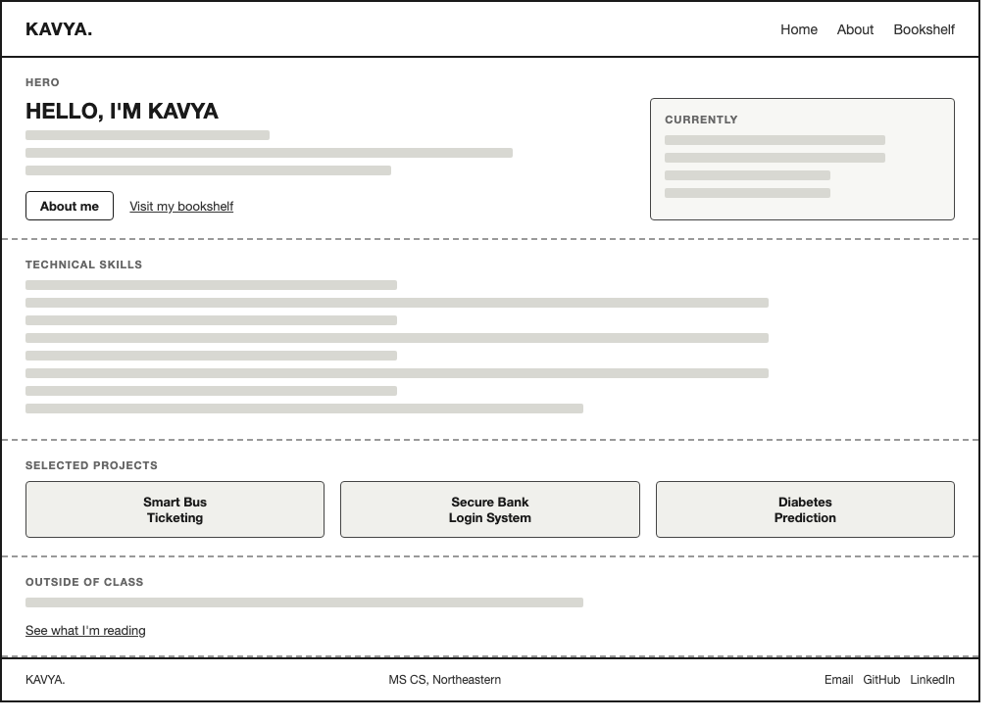
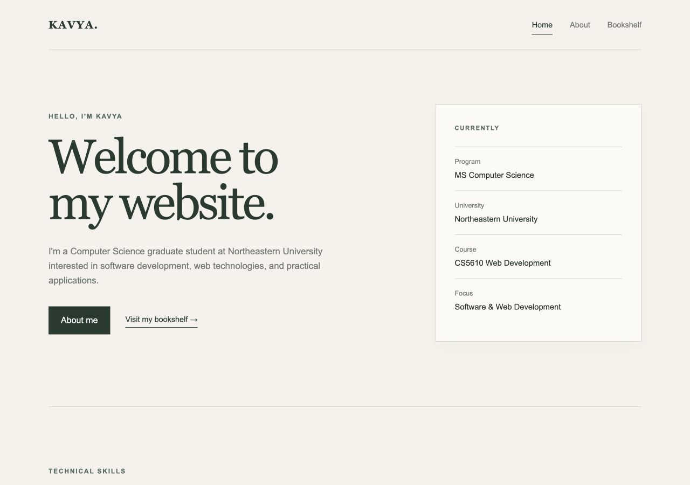
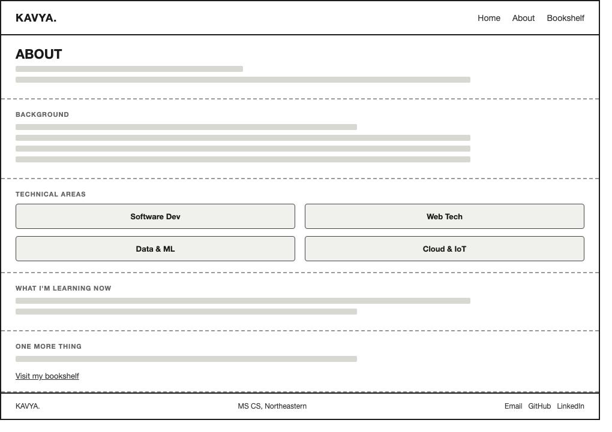
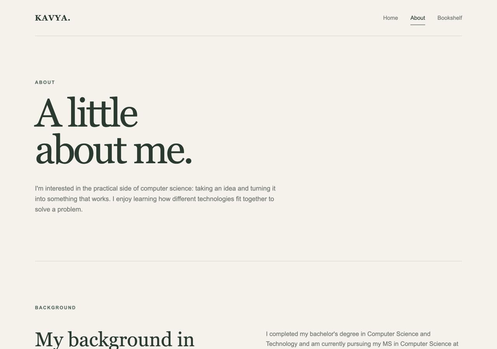
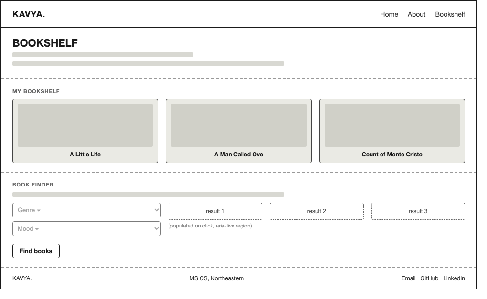
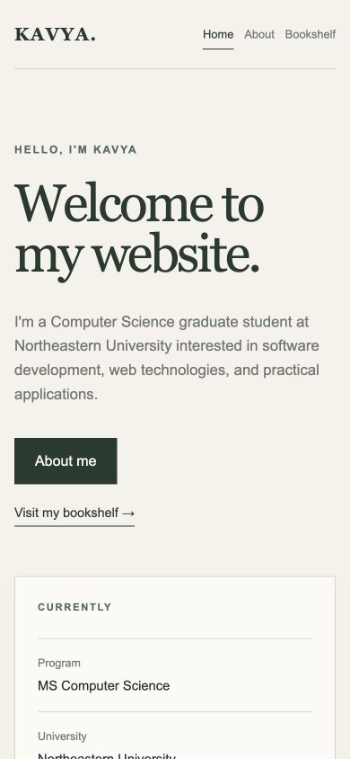
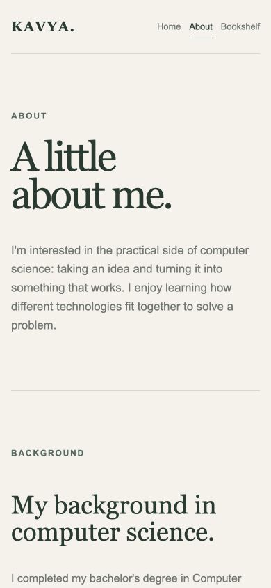
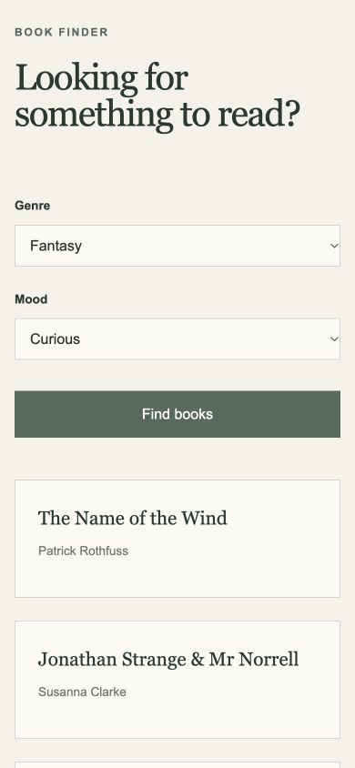

# Personal Homepage: Design Document

**Author:** Kavya Kusuma Reddy Korem  
**Course:** CS5610.18490 Web Development, Northeastern University, Fall 2026  
**Project:** Project 1, Personal Homepage  
**Live site:** <https://kavya-korem.github.io/cs5610-project1/>

## 1. Project description

### Overview

This project is a three-page personal website for Kavya Kusuma Reddy Korem, an MS Computer Science student at Northeastern University. It gives visitors a quick view of her background, technical skills, and selected work, then offers a personal interest through a Bookshelf page.

### Objective

Create a clear personal homepage that connects academic and technical experience with an interest in reading. Visitors can learn about Kavya, find contact links, and use a small book finder to choose something to read.

### Pages

| Page      | File           | Purpose                                                              |
| --------- | -------------- | -------------------------------------------------------------------- |
| Home      | `index.html`   | Introduction, current program, grouped skills, and selected projects |
| About     | `about.html`   | Academic background, technical areas, and current learning           |
| Bookshelf | `ai-page.html` | Favorite books and three recommendations for a chosen genre and mood |

Home presents the Smart Bus Ticketing System, Secure Bank Login System, and Diabetes Prediction Model. About expands on the background behind those projects. Bookshelf provides a separate, useful interaction for visitors interested in reading.

### Technologies

The implementation uses semantic HTML5, CSS3 Grid and Flexbox, and native JavaScript modules. ESLint and Prettier support code quality. The website is static, with no frontend framework or build step. All book recommendations come from a local dataset.

## 2. User personas

These personas represent intended visitors and guide page organization.

### Persona 1: Priya, hiring manager

**Background:** Screens candidates for software development roles and often checks portfolios between meetings.  
**Goals:** Identify Kavya's program, technical skills, and relevant work quickly, then find a contact method.  
**Frustrations:** Long introductions that hide project evidence and layouts that are difficult to read on a phone.  
**How she uses the site:** Starts on Home, scans the skills and projects, and uses the shared footer to find email or GitHub.

### Persona 2: Sam, fellow graduate student

**Background:** A CS5610 peer interested in Kavya's coursework and possible project collaboration.  
**Goals:** Understand her technical areas, inspect concrete examples of work, and try the interactive page.  
**Frustrations:** Incomplete navigation and interactions that fail for some input choices.  
**How he uses the site:** Opens About, browses the Home project summaries, and tests the Bookshelf finder.

### Persona 3: Alex, book lover

**Background:** Arrives through a shared link and is primarily interested in reading recommendations.  
**Goals:** See Kavya's favorite books and get suggestions that match a genre and current mood.  
**Frustrations:** Recommendation tools hidden behind unrelated professional content or requiring an account.  
**How he uses the site:** Goes directly to Bookshelf and uses the labeled selection controls.

### Why these personas

Priya needs a fast professional overview, Sam needs enough background to evaluate shared interests, and Alex needs the Bookshelf page to be useful on its own. Their different entry points give all three pages a clear purpose.

## 3. User stories

1. **As a hiring manager,** I want to see Kavya's degree and university in the Home introduction so that I can understand her current academic context.
2. **As a hiring manager,** I want grouped technical skills and selected project summaries so that I can assess relevant experience without opening several pages.
3. **As any visitor,** I want email, GitHub, and LinkedIn links in the footer so that I can reach Kavya or explore her profile.
4. **As a fellow student,** I want an About page describing academic background and current learning so that I can identify possible areas for collaboration.
5. **As a fellow student,** I want the same navigation on every page so that I can move between Home, About, and Bookshelf easily.
6. **As a reader,** I want to see a few books Kavya has enjoyed so that I can understand her reading interests.
7. **As a reader,** I want to choose a genre and mood and receive three suggestions so that I can compare possible books without leaving the page.
8. **As a keyboard or screen reader user,** I want native labeled controls and an announced results region so that I can operate the finder.
9. **As a visitor on a phone,** I want page sections and recommendation cards to stack so that I can read the site without horizontal scrolling.

### Feature coverage

| Feature                                         | Stories |
| ----------------------------------------------- | ------- |
| Home introduction and current-program panel     | 1       |
| Grouped skills and selected projects            | 2       |
| Shared contact footer                           | 3       |
| About background and learning sections          | 4       |
| Consistent three-link navigation                | 5       |
| Favorite-book covers, titles, and authors       | 6       |
| Genre and mood finder with three results        | 7       |
| Native labels, selects, button, and live region | 8       |
| Responsive Grid and Flexbox layouts             | 9       |

## 4. Design mockups and implemented pages

The supplied wireframes describe the intended section order. The accompanying viewport screenshots show the actual pages and selected sections in this revision. The Home implementation expands the wireframe's compact project boxes into larger project cards with descriptions and technology labels.

### 4.1 Home

**Wireframe**

**Implemented page**

The desktop hero places the introduction beside a current-program panel. Skills appear as labeled rows. The three project cards contain a title, a short description, and the technologies involved. The closing section links to Bookshelf.

### 4.2 About

**Wireframe**

**Implemented page**

A short introduction leads into an academic-background section. Four technical-area cards cover Software Development, Web Technologies, Data and Machine Learning, and Cloud and IoT. Current-learning text and a Bookshelf link complete the page.

### 4.3 Bookshelf

**Wireframe**

**Implemented page**

The page displays _A Little Life_ by Hanya Yanagihara, _A Man Called Ove_ by Fredrik Backman, and _The Count of Monte Cristo_ by Alexandre Dumas. Local SVG illustrations provide the covers. The book finder sits below the personal shelf.

**Book finder after a selection**

Fantasy with Curious returns _The Name of the Wind_, _Jonathan Strange & Mr Norrell_, and _The Once and Future Witches_, with their authors.

### 4.4 Mobile layouts

At 800px and below, the hero, skills rows, About layouts, bookshelf grid, and finder become single-column layouts, and the footer stacks vertically. At 500px and below, navigation spacing and project-card padding reduce, and the hero links stack.

The screenshots below show the actual pages at a 390px viewport width. All three pages fit that width without horizontal overflow.

| Home                                                  | About                                                   | Bookshelf with results                                          |
| ----------------------------------------------------- | ------------------------------------------------------- | --------------------------------------------------------------- |
|  |  |  |

## 5. Visual design decisions

### Color system

The warm cream background and forest-green headings give the site a quiet reading-oriented appearance. Sage accents connect the portfolio pages to the bookshelf. CSS custom properties in `css/style.css` hold the shared palette.

| Role                          | CSS token      | Color     |
| ----------------------------- | -------------- | --------- |
| Page background               | `--background` | `#f5f2ea` |
| Card surface                  | `--surface`    | `#fbfaf6` |
| Headings and primary controls | `--forest`     | `#263b30` |
| Accent text                   | `--green`      | `#526b5c` |
| Sage accent                   | `--sage`       | `#a6b5a3` |
| Body text                     | `--text`       | `#28302b` |
| Secondary text                | `--muted`      | `#70766f` |
| Dividers                      | `--line`       | `#d9d6cc` |

### Typography and spacing

Georgia and Times New Roman provide serif headings. Arial and Helvetica provide body text and controls. These system-font stacks need no web-font download. Large headings, generous section spacing, and thin dividers separate the content without adding navigation complexity.

### Layout

A shared 1100px maximum content width aligns the header, main sections, and footer. Grid handles the hero, technical areas, bookshelf, and finder. Flexbox aligns navigation, links, and footer content. Responsive rules change these arrangements to suit smaller screens.

### Accessibility

Each page declares its language, includes a descriptive title, and uses semantic landmarks. Every section has its own heading. The Bookshelf heading is an h2, and the individual book titles are h3 elements. The navigation has a Main navigation label, and the active link uses `aria-current="page"`. Book-cover images have alt text. The finder uses real `label`, `select`, and `button` elements, with associated label targets and an `aria-live="polite"` results container. Native controls retain keyboard behavior and the browser's default focus indication.

## 6. Content strategy and interaction

### Page organization

Home answers who Kavya is and what she has worked on. About explains her academic background and technical interests. Bookshelf shares a personal interest and offers an interaction that does not depend on reading the portfolio first. The footer makes email and professional-profile links available on every page.

### Book finder behavior

| Part               | Implementation                                                           |
| ------------------ | ------------------------------------------------------------------------ |
| Genre input        | Fiction, Mystery, Fantasy                                                |
| Mood input         | Thoughtful, Adventurous, Cozy, Curious                                   |
| Trigger            | Find books button                                                        |
| Dataset            | Local nested object in `js/main.js`, with 12 genre and mood combinations |
| Result             | Three articles, each containing a book title and author                  |
| DOM update         | Existing results clear, then new elements append without a page reload   |
| Network dependency | None for recommendations                                                 |

The script checks whether the finder button exists before attaching its listener, so the same module can load on Home and About. Book titles and author names enter the DOM through `textContent`.

### Implementation verification

A browser check exercised every genre and mood combination. Each of the 12 combinations produced three recommendation cards. The browser reported no errors or warnings during those checks. Separate checks at a 390px viewport width confirmed that Home, About, and Bookshelf had no horizontal overflow. These checks describe the tested local revision rather than every possible device or accessibility scenario.

## 7. Out of scope

The site has no login, account system, backend, database, saved reading list, or personalized learning algorithm. Recommendations depend only on the selected genre and mood. The selected-project cards present summaries rather than hosting the projects themselves. Email and professional-profile links lead to their respective services.
